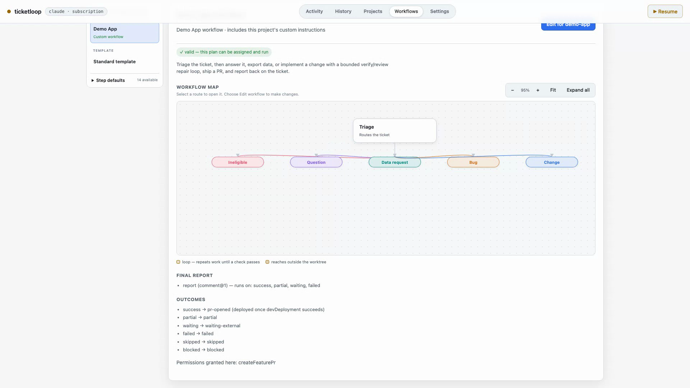

# Ticketloop

Ticketloop turns trusted Linear tickets into repeatable coding-agent workflows. It runs locally, uses your Claude Code or Codex subscription, isolates code changes in git worktrees, and stops at a pull request for human review.

The local dashboard lets each project choose and customize a visual workflow. Every step can have its own instruction, provider, model, and effort.



[Watch the 20-second workflow builder demo](docs/assets/ticketloop-workflow-builder-demo.mp4).

> Ticketloop is an early public release. Start with mock mode, then use a small test project and a dedicated Linear opt-in label. Do not connect an untrusted or public ticket source.

## What Ticketloop handles

- Questions: inspect the repository and post an answer.
- Data requests: prepare and verify a read-only export, then report it on the ticket.
- Bugs: locate existing work, reproduce, implement, verify, review, and open or update a pull request.
- Changes: plan, implement, verify, review, and open or update a pull request.
- Feedback: resume the same ticket and refresh its existing pull request.

Triage routes each eligible ticket into the right path. Failed checks can return to an implementation step through bounded repair loops. Completed steps are checkpointed so a failed or paused run can continue without paying to repeat all prior work.

Ticketloop does not deploy to production. Dev deployment steps are optional, permission-gated, and disabled by default.

## Requirements

- macOS or Linux. Windows is supported through WSL2, not native PowerShell.
- Node.js 22 or 24.
- Git.
- GitHub CLI (`gh`) logged in if a workflow opens pull requests.
- Claude Code, Codex CLI, or both, logged in with the subscription you intend to use.
- A Linear personal API key for real projects.

See [Supported platforms](SUPPORTED_PLATFORMS.md) for the tested support policy.

## Install

```bash
npm install --global @the-good-pixel/ticketloop
ticketloop --version
ticketloop doctor
```

To run without a global install:

```bash
npx @the-good-pixel/ticketloop --version
```

## Try it safely

```bash
ticketloop demo
```

Demo mode uses built-in tickets and a simulated agent. It uses no provider quota, tracker credential, or network request. Open the printed local dashboard URL and inspect the Activity and Workflows views. Press `Ctrl-C` to stop.

## Connect the first project

```bash
mkdir ticketloop-workspace
cd ticketloop-workspace
ticketloop init
ticketloop watch
```

Open [http://127.0.0.1:4317/#setup](http://127.0.0.1:4317/#setup), then:

1. Choose the local git repository.
2. Choose a workflow.
3. Set the Linear team, opt-in label, eligible states, and API key.
4. Review and save.

The first project is saved while ticket processing is paused. Check the project card and visual workflow, add the opt-in label to one low-risk test ticket, then resume from Activity.

The generated `ticketloop.config.yml` is intentionally small. Advanced project, provider, permission, multi-repo, and MCP settings are documented in [ticketloop.config.example.yml](ticketloop.config.example.yml) and the [setup guide](SETUP.md).

## The workflow builder

Open Workflows in the dashboard to:

- choose the workflow assigned to a project;
- add work steps from the step catalog;
- add triage branches and bounded loops;
- configure each step’s provider, model, effort, and instruction;
- edit a step’s reusable default instruction;
- save an immutable new workflow version for one project.

Workflows are structured trees of sequences, branches, and loops. Multiple loops can appear on one path, but loops cannot be nested. The preview is compiled and validated against the selected project before it can be assigned.

Editing a workflow for a project creates a new immutable version and assigns that version to the project. The standard template and other projects do not change.

## Safety model

Ticketloop runs headless coding agents with broad tool access. Safety comes from enforced boundaries, not permission prompts:

- The dashboard binds to `127.0.0.1` by default.
- Change work uses an isolated git worktree based on the remote default branch.
- The harness removes delivered or fully shipped worktrees deterministically; resumable and failed worktrees remain available for continuation or inspection.
- Project exclude rules block protected-path changes before shipping.
- Workflow capabilities are validated against explicit project permissions.
- Instruction text cannot grant workflow authority.
- Pull requests are the normal human review boundary.
- Automatic merging and dev deployment are off unless explicitly granted.
- Production deployment is never supported.
- New activity invalidates an old checkpoint so stale work is not resumed against a changed request.

Only process tickets and comments written by people you trust. Read [SECURITY.md](SECURITY.md) before connecting a real project.

## Continue, start over, and pause

- Continue run reuses completed steps and resumes at the interrupted work.
- Start over discards the checkpoint and runs the current workflow from the beginning.
- `ticketloop pause` stops new work and checkpoints an in-flight run at the next step boundary.
- `ticketloop pause APP-123` pauses one ticket.
- `ticketloop resume` or the Activity button resumes processing.

Use Start over after changing an earlier step whose completed output must be regenerated. Use Continue run for connection failures, provider limits, daemon restarts, and unchanged work.

## Commands

| Command | Purpose |
| --- | --- |
| `ticketloop --version` | Print the installed version. |
| `ticketloop init` | Create a minimal first-run config. |
| `ticketloop demo` | Run the offline mock workflow and dashboard. |
| `ticketloop doctor` | Check configuration, tools, provider login mode, repositories, and tracker keys. |
| `ticketloop watch` | Poll Linear, run workflows, and serve the dashboard. |
| `ticketloop run [--ticket ID]` | Run one scan or one ticket, then exit. |
| `ticketloop pause [ID]` | Pause all work or one ticket at the next step boundary. |
| `ticketloop resume [ID]` | Resume all work or one ticket. |
| `ticketloop status` | Show provider quota and recent runs. |
| `ticketloop support-bundle` | Write redacted diagnostics designed for a public issue. |
| `ticketloop steps [id@version]` | List catalog steps or inspect one version. |
| `ticketloop workflows` | List workflows and project assignments. |
| `ticketloop workflow show --project NAME` | Print the compiled plan for a project. |
| `ticketloop workflow validate` | Validate every assigned workflow and permission. |

Common flags: `--config <path>`, `--mock`, `--ticket <ID>`, `--project <name>`, and `--debug`.

## Data and credentials

Runtime state lives under `~/.ticketloop` by default:

- `credentials.json`: per-project tracker keys, user-readable only where the operating system supports file modes;
- `runs/`: local run history;
- `checkpoints/`: resumable work;
- `catalog/`: user-created immutable step and workflow versions;
- `control.json`: global and per-ticket pause state;
- `provider-quota.json`: the last provider-reported usage windows.

Set `TICKETLOOP_HOME` to isolate all state for testing. Real config and local state are ignored by git.

Subscription mode removes provider API-key environment variables from the child process so a shell variable cannot silently change the billing path. API authentication is also supported through explicit provider configuration.

## Troubleshooting

Start with:

```bash
ticketloop doctor
ticketloop workflow validate
ticketloop support-bundle
```

Review the generated support JSON before attaching it to a bug report. The bundle omits credential values, paths, project and ticket names, ticket content, prompts, agent output, raw errors, and pull-request URLs.

Report bugs through the [issue form](https://github.com/the-good-pixel/ticketloop/issues/new/choose). Report vulnerabilities only through [private vulnerability reporting](https://github.com/the-good-pixel/ticketloop/security/advisories/new).

## Current limitations

- Linear is the only real tracker adapter.
- GitHub is the only pull-request adapter.
- The daemon is local and single-user; there is no hosted multi-user control plane.
- Tickets are trusted input. Ticketloop is not a sandbox for hostile prompts.
- Native Windows is not supported.
- Before `1.0.0`, minor versions may contain config or workflow changes that require review.

## Development

```bash
git clone https://github.com/the-good-pixel/ticketloop.git
cd ticketloop
npm install
npm run check
npx tsx src/cli.ts demo
```

There is no build step. TypeScript runs through `tsx`; the dashboard is plain HTML, CSS, and JavaScript.

Read [CONTRIBUTING.md](CONTRIBUTING.md), [UPGRADING.md](UPGRADING.md), and [CHANGELOG.md](CHANGELOG.md) before contributing or updating. Architecture details live in [docs/architecture.html](docs/architecture.html).

## License

MIT
